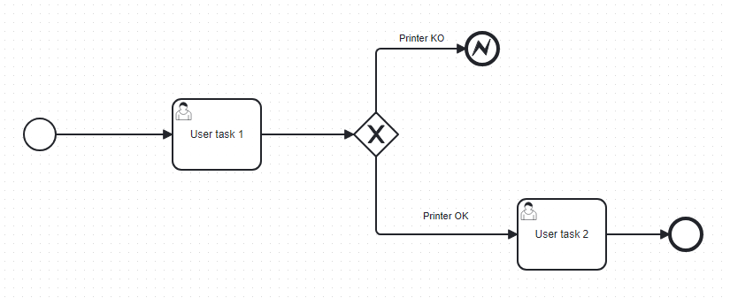

# atm-layer-wf-process
This microservice serves as entrypoint to Camunda 7 platform. Manipulates and processes requests received from other microservices in atm-layer and makes possible to navigate through an instance of a deployed bpmn diagram which represents a specified business process.

## Prerequisites
* Install an instance of Camunda platform 7
* JDK 17
* GraalVM 17 (necessary in case of a locally native build is needed)
* Docker (necessary in case of build into container is needed)

## Installation
For testing purpose, launch it in quarkus dev mode and make sure that an instance of Camunda 7 is running under the address and port specified in application.properties file.

```bash
./mvnw quarkus:dev
```

<p>Once runned locally connect to [http://localhost:8702], visit the Dev UI and navigate to the swagger UI to see the exposed endpoints.</p>
<p>If containerization is needed run: </p>

```bash
docker build -f src/main/docker/Dockerfile.native-micro
```

This command will build a native image and deploy it into a container. Make sure that system variables are present.

## Usage
<p>A postman collection for testing purpose is available under folder ./docs/postman </p>
<p>An example of a bpmn is provided under ./docs/example </p>

<!-- example bpmn -->
<br />
<div align="center">
  <a>
    
  </a>
</div>
<br />

<p>For testing purpose directly call the "Create" endpoint exposed by Camunda [https://docs.camunda.org/rest/camunda-bpm-platform/7.20/#tag/Deployment/operation/createDeployment] and pass only the diagram_example.bpmn. </p>
<p>Inside the postman collection there are differents REST calls to the microservice's exposed endpoints which can be used to communicate with Camunda platform: </p>

* [DEPLOY] Deploy a bpmn diagram (also a dmn or a form) through a download link.
* [START] Start and instance of a deployed diagram and retrieve the active tasks.
* [NEXT] Complete a task, move on to another and retrieve the active tasks.
* [VARIABLES] Retrieve variables of a specified task and filter them based on the ones you want.
* [RESOURCE] Get the resource XML of deployment through the deployment ID.
* [UNDEPLOY] Undeploy a deployed bpmn with a given ID.

### Build with
[](https://quarkus.io/)
[](https://www.oracle.com/java/technologies/javase-jdk17-downloads.html)
[](https://camunda.com/)
[](https://aws.amazon.com/sdk-for-java/)


